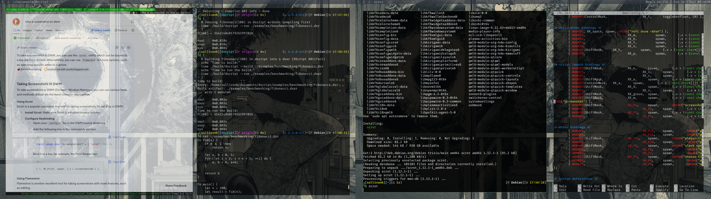

# dscript

A small, expressive scripting language in C++ focused on personalization.

## Why dscript is cool

- **Custom keyword-style callables** with `def` (write APIs that read like language keywords)
- **Pass expressions and blocks as arguments** with `%expr` and `$block`
- Named block arguments like `pass: { ... }`, `fail: { ... }`
- Functions, classes, inheritance, loops, imports, and stdlib I/O

## 30-second quick start

```bash
./build.sh
# run a normal .dsr script directly
./build/dscript --run examples/18_def_keyword_showcase.dsr
```

## CLI

`--run` works for both source scripts and built artifacts.

`dscript` supports these modes:

```bash
./build/dscript --repl
./build/dscript --run <script_or_artifact> [args...]
./build/dscript --build <entry_script> [artifact_path]
./build/dscript --help
./build/dscript --version
```

Run a script directly:

```bash
./build/dscript --run examples/01_literals_and_ops.dsr
```

Backward-compatible script invocation still works:

```bash
./build/dscript examples/18_def_keyword_showcase.dsr

# pass script arguments (available as io.program_args)
./build/dscript --run examples/18_def_keyword_showcase.dsr one two
```

## Build artifacts (`.dsar`)

`--build` resolves modules and emits a self-contained JSON artifact that can be run on another system without source files.

Default output naming:

- Input `foo.dsr` -> output `foo.dsar`
- You can override with an explicit `artifact_path`

Typical flow:

```bash
# Build artifact
./build/dscript --build examples/23_imports_and_modules.dsr

# Run artifact
./build/dscript --run examples/23_imports_and_modules.dsar
```

Artifact contents include:

- Entry module ID
- Full AST for each module
- Resolved locals metadata used by runtime variable resolution
- Module import mapping for cross-module execution
- Runtime artifact imports (`import './other.dsar' as mod`) from scripts or other artifacts

<table>
    <tr>
        <td valign="top" width="190">
            <a href="imgs/bench.png">
                
            </a>
        </td>
        <td valign="top">
            <strong>Fibonacci benchmark snapshot</strong><br />
            Console timing summary (Linux <code>time</code>): running <code>fibonacci(100)</code> from source took about <code>0m0.010s</code>. Building an artifact took about <code>0m0.003s</code>, and running that built artifact took about <code>0m0.003s</code>.<br />
            In short: for this tiny workload, artifact execution is faster than direct source execution, and even build+run combined (~<code>0m0.006s</code>) was lower than the source-only run in this measurement. Click the preview to open the full-size chart.
        </td>
    </tr>
</table>

## Signature feature #1: custom keywords with `def`

`def` lets you build callables that are invoked in keyword-like style:

```dsr
def shout(msg) {
    log('shout: ' + msg);
}

shout 'hello';
```

You can create APIs that read like mini-language constructs:

```dsr
def guard(cond) (pass: $pass_block, fail: $fail_block) {
    if cond then {
        if $pass_block is not none then $pass_block();
    } else {
        if $fail_block is not none then $fail_block();
    }
}

guard energy > 3 pass: {
    log('allowed');
} fail: {
    log('blocked');
}
```

## Signature feature #2: pass blocks (and expressions) as args

dscript supports expression and block parameters directly:

```dsr
fn x(%expr) ($block) {
    %expr();
    $block();
}

x i = 10 {
    log(i);
}
```

- `%name` receives an expression/callable argument
- `$name` receives a block argument
- Named blocks can be optional (`none`) and checked at runtime

## Class extras: private fields + default init

dscript classes support a private-field declaration block and an `init` shorthand:

```dsr
class Reader {
    (
        idx = 0,
        script,
    )

    fn init(script) = def;
}
```

- Fields listed in `(...)` are private to the declaring class methods.
- `fn init(a, b, ...) = def;` expands to assigning each parameter to `self` (`self.a = a`, `self.b = b`, ...).
- Private fields can include default values (`name = expr`) or omit them (defaults to `none`).

## Feature tour (examples)

- Literals/operators: `examples/01_literals_and_ops.dsr`
- Variables/scope: `examples/02_variables_assignment_scope.dsr`
- Conditionals/loops: `examples/03_if_else_and_logic.dsr` to `examples/06_functions_and_return.dsr`
- `def` keyword callables: `examples/07_def_callable_keyword.dsr`, `examples/18_def_keyword_showcase.dsr`
- Expr/block identifiers: `examples/10_expr_and_block_identifiers.dsr`
- Named blocks: `examples/12_named_blocks_and_none.dsr`
- Classes/inheritance: `examples/08_classes_fields_methods.dsr`, `examples/09_inheritance_super_self.dsr`
- Private members + default initializer: `examples/29_private_members.dsr`, `examples/30_default_initializer.dsr`
- Imports/modules: `examples/23_imports_and_modules.dsr`
- Artifact imports: `examples/31_artifact_imports.dsr` (build `examples/lib/math.dsr` to `examples/lib/math.dsar` first)
- Stdlib I/O: `examples/24_stdlib_io.dsr`
- Stdlib random: `examples/32_stdlib_random.dsr`
- Stdlib math: `examples/33_stdlib_math.dsr`
- DScript stdlib authoring: `examples/35_dscript_stdlib.dsr`

## Write stdlibs in dscript

You can author stdlibs in dscript and import them by module name.

- Place DScript stdlib sources under `./stdlibs/dsr/`
- Build artifacts are emitted under `./stdlibs/dsar/`
- Import by name, for example: `import text as text;`
- Runtime lookup for `import name`:
    1. Native stdlib named `name`
    2. `./stdlibs/dsr/name.dsr`
    3. `./stdlibs/dsar/name.dsar`
- `import 'std:name' as mod;` is also supported and uses the same DScript stdlib lookup.

This keeps native stdlibs (`io`, `math`, etc.) working while allowing dscript-authored stdlibs.

Folder split for clarity:
- C++ stdlibs live in `./runtime/stdlibs/`
- DScript stdlib sources live in `./stdlibs/dsr/`
- DScript stdlib artifacts live in `./stdlibs/dsar/`

During CMake builds, all `./stdlibs/dsr/*.dsr` modules are precompiled to `./stdlibs/dsar/*.dsar`. If any precompile step fails, the build fails.

## Build options

- Dev build: `./build.sh [BuildType] [BuildDir]`
- Release matrix build: `./build_release.sh [BuildRoot]`

### Notes

- Artifact extension is configured in `app/cli.cpp` via a preprocessor definition near `Version`.

## Project layout

- `lexing/` tokenization
- `parsing/` AST + parser
- `resolving/` name/scope resolution
- `runtime/` VM, values, objects, stdlibs